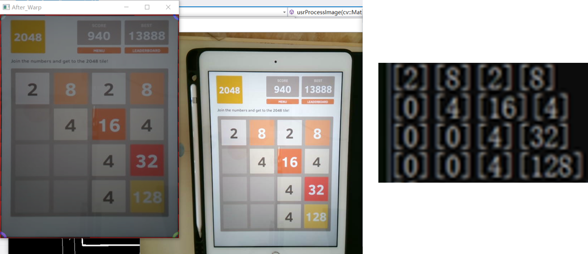

# SJTU-Digital-Image-Processing-Project
A group project for **Digital Image Processing** course in SJTU  

Demo: [Twitter](https://twitter.com/l_zhicheng/status/1213110045455470593?s=20)

Members: You Jun Hao, [Lee Zhicheng](https://github.com/ZhiCheng0326), [Yap Mou Yuan](https://github.com/mouyuanyap)

# Image processing
1) Canny Edge Detection  

2) Extract Contour  

3) Affine transformation  

4) Extract digits in each tile  

5) Hog + SVM to identify each digit  

# Acknowledgement
The hardware and software are prepared by teachers and teaching assistants. (Refer [github](https://github.com/LostXine/qtCyberDIP)). We modified `usrGameController.h` and `usrGameController.cpp` to perform image processing and algorithm to control movements of the robotic arm.
